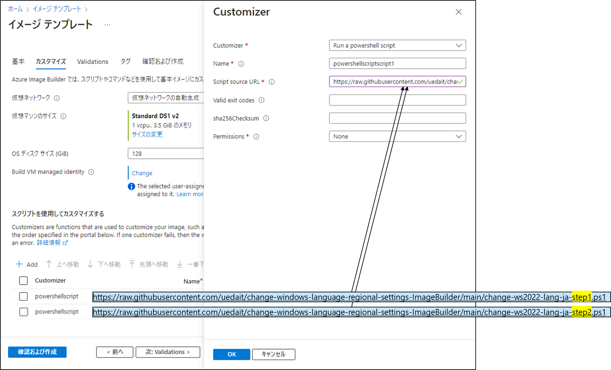

# change-windows-language-regional-settings-ImageBuilder
- このリポジトリは、以下のリポジトリを参照して Azure Image Builder 用に作成したものです。
- This repository is for Azure Image Builder and was created by referencing.
  - https://github.com/tksh164/change-windows-language-regional-settings
  
  

## 使い方
この PowerShell スクリプトは Windows Server 2022 用です。

Azure Image Builder で Windows Server 2022 のイメージに対し、2つを続けて実行するよう設定することで、日本語化された VMイメージ を作成できます。

## スクリプトの説明
2つの スクリプト は、それぞれ以下の処理を行います。

- change-ws2022-lang-ja-step1.ps1:

1. 日本語ランゲージパックをダウンロードする。
2. 日本語ランゲージパックをシステムにインストールする。
3. 日本語に関連する機能をシステムにインストールする。
4. システムのタイムゾーンを設定する。
5. システムを再起動する。

- change-ws2022-lang-ja-step2.ps1:

1. 現在のユーザーの言語オプションを設定し、それをデフォルトのユーザーアカウントとシステムアカウントにコピーする。加えて、システムロケールを設定する。
2. システムを再起動する。

## Thanks

- [@tksh164](https://github.com/tksh164/change-windows-language-regional-settings)
